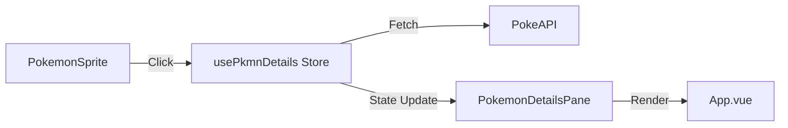

# Requirements

### Overview & Goals
Implement a detailed view for Pokémon that have been found during the quiz. This view will provide additional information fetched from the PokeAPI and will be presented in a modern, sliding pane from the right side of the screen.

### Scope
- **In Scope**:
    - Fetching data from PokeAPI (`pokemon` and `pokemon-species` endpoints).
    - Sliding pane UI with high-quality artwork and detailed stats.
    - Click interactions on found Pokémon in the grid.
    - Responsive design for the details pane.
- **Out of Scope**:
    - Details for Pokémon not yet found.
    - Evolution chains (unless easily accessible from fetched data).
    - Competitive move sets or advanced data.


# Technical Design

### Current Implementation
- Pokémon are displayed in a grid using `RegionBoxes.vue` and `PokemonSprite.vue`.
- State is managed via Pinia stores (e.g., `usePkmnData`, `usePokemons`).
- A centralized dialog system exists for full-screen overlays.

### Proposed Changes
1.  **Store: `usePkmnDetails`**:
    - A new Pinia store to manage the state of the details pane and cache fetched data.
    - Fetches from `https://pokeapi.co/api/v2/pokemon/{id}` and `https://pokeapi.co/api/v2/pokemon-species/{id}`.
2.  **Component: `PokemonDetailsPane`**:
    - A new component that renders the Pokémon details.
    - Features a header with the artwork and basic info.
    - Sections for Pokedex entry, stats, and additional data.
    - Responsive layout (takes more width on mobile).
3.  **Transition: `SlideInRightTransition`**:
    - A custom Vue transition to animate the pane sliding from the right.
4.  **Integration**:
    - Add a click handler to `PokemonSprite.vue`.
    - Place the `PokemonDetailsPane` in `App.vue` to ensure it stays on top.

### Data Model
```typescript
interface PokemonDetails {
  id: number;
  name: string;
  artwork: string;
  dexNum: number;
  types: string[];
  species: string;
  abilities: string[];
  height: number;
  weight: number;
  catchRate: number;
  description: string;
  stats: { name: string; value: number }[];
  genderRatio: { male: number; female: number } | 'genderless';
}
```

### Architecture Diagram



# Testing

### Validation Approach
- **Manual Verification**:
    - Click on various found Pokémon and ensure the pane opens with correct data.
    - Verify that data matches the expected Pokémon.
    - Check the sliding animation for smoothness.
    - Test responsiveness on mobile and desktop viewports.
    - Verify that the pane can be closed (e.g., clicking outside or a close button).
- **Key Scenarios**:
    - Opening details for a base form Pokémon.
    - Opening details for a Pokémon with multiple forms (ensuring correct form data is fetched if possible).
    - Handling API errors gracefully (showing a message).
    - Switching between Pokémon without closing the pane.


# Delivery Steps

###   Step 1: Create usePkmnDetails store and API integration
Implement the Pinia store to handle fetching and caching Pokémon details from PokeAPI.
- Create `src/stores/usePkmnDetails.ts` using the setup pattern.
- Implement `fetchPokemonDetails` action that calls both `/pokemon` and `/pokemon-species` endpoints.
- Define reactive state for `selectedPokemonId`, `details` (cache), `loading`, and `error`.
- Add types for the API responses and the internal data model.

###   Step 2: Develop PokemonDetailsPane and SlideInRightTransition components
Build the sliding pane UI and the transition for the sliding effect.
- Create `src/components/common/transitions/SlideInRightTransition.vue`.
- Create `src/components/game/PokemonDetailsPane.vue` with sections for:
    - High-quality official artwork.
    - Basic info: Name, Dex Number, Types, Species, Abilities, Height, Weight, Catch Rate.
    - Pokedex description.
    - Base Stats (with visual bars).
    - Gender Ratio.
- Use UnoCSS for layout and styling.

###   Step 3: Integrate the details pane into the game and add translations
Wire up the click event and display the pane in the app.
- Update `src/components/game/PokemonSprite.vue` to trigger `showDetails` on click if the Pokémon is found.
- Add `PokemonDetailsPane` to `src/App.vue`.
- Add necessary translation keys to `src/locales/en.json` (and other locales if possible, or just placeholders).
- Ensure the pane is responsive and works well on mobile.