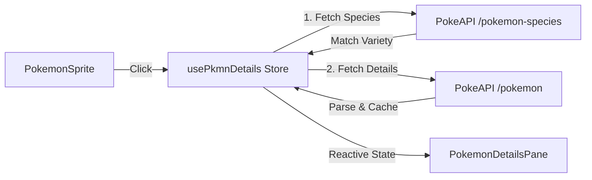

# Requirements

### Overview & Goals
Implement a detailed view for Pokémon that have been found during the quiz. This view will provide comprehensive information fetched from PokeAPI, presented in a modern, sliding pane from the right side of the screen. It will support form-specific data (Megas, Regionals, etc.) by mapping internal IDs to PokeAPI varieties.

### Scope
- **In Scope**:
    - Fetching data from PokeAPI (`pokemon` and `pokemon-species` endpoints).
    - Robust mapping of internal Pokémon IDs to PokeAPI varieties using the `varieties` array.
    - Sliding pane UI with high-quality official artwork and detailed stats.
    - Displaying: Name, Dex Number, Types, Species, Abilities, Height, Weight, Catch Rate, Pokedex description, Base Stats (with bars), and Gender Ratio.
    - Responsive design for mobile and desktop.
- **Out of Scope**:
    - Details for Pokémon not yet found.
    - Evolution chains.
    - Competitive move sets or advanced battle data.

# Technical Design

### Current Implementation
- Pokémon are displayed in a grid using `RegionBoxes.vue` and `PokemonSprite.vue`.
- State is managed via Pinia stores (`usePkmnStore`, `usePokemons`).
- A centralized dialog system exists, but this feature will use a custom sliding pane for a less intrusive experience.
- A basic `usePkmnDetails` store exists but needs refinement for data parsing and variety support.

### Key Decisions
- **SDK choice**: Use `pokenode-ts` to interact with PokeAPI. This provides full type safety and a clean API for fetching Pokémon and species data.
- **Form Mapping Strategy**: Fetch species data first using `dexNum`, then match the internal `id` against the `varieties` array by comparing names with dashes removed. This ensures correct stats for Megas and Regional forms.
- **Data Parsing in Store**: Perform all data transformation in the store when fetching to keep the component logic focused on rendering.
- **Caching**: Use a `detailsMap` in the Pinia store to cache fetched Pokémon details and avoid redundant API calls.

### Proposed Changes
1.  **Type: `PokemonDetails`**:
    - Define the interface in `src/types.ts` with all required fields (artwork, stats, gender ratio).
2.  **Store: `usePkmnDetails`**:
    - Implement a two-step fetch process (Species -> Variety -> Details).
    - Add a `parsePokemonData` utility to transform raw API responses.
    - Manage `detailsMap` for caching and `selectedId` for UI state.
3.  **Transition: `SlideInRightTransition`**:
    - A new custom transition in `src/components/common/transitions/SlideInRightTransition.vue` for the sliding effect.
4.  **Integration**:
    - Add `PokemonDetailsPane` to `App.vue`.
    - `PokemonSprite.vue` already has a click handler that triggers `displayPokemonDetails`.

### Data Model
```typescript
export interface PokemonDetails {
  id: number;
  name: string;
  artwork: string;
  dexNum: number;
  types: string[];
  species: string;
  abilities: string[];
  height: number;
  weight: number;
  catchRate: number;
  description: string;
  stats: { name: string; value: number }[];
  genderRatio: { male: number; female: number } | 'genderless';
}
```

### Architecture Diagram


# Testing

### Validation Approach
- **Manual Verification**:
    - Click on various found Pokémon and ensure the pane opens with correct data.
    - Verify that data matches the expected Pokémon.
    - Check the sliding animation for smoothness.
    - Test responsiveness on mobile and desktop viewports.
    - Verify that the pane can be closed (e.g., clicking outside or a close button).
- **Key Scenarios**:
    - Opening details for a base form Pokémon.
    - Opening details for a Pokémon with multiple forms (ensuring correct form data is fetched if possible).
    - Handling API errors gracefully (showing a message).
    - Switching between Pokémon without closing the pane.

## Steps

### ✓ Step 1: Create usePkmnDetails store and API integration
### ✓ Step 2: Develop PokemonDetailsPane and SlideInRightTransition components
### ✓ Step 3: Integrate the details pane into the game and add translations