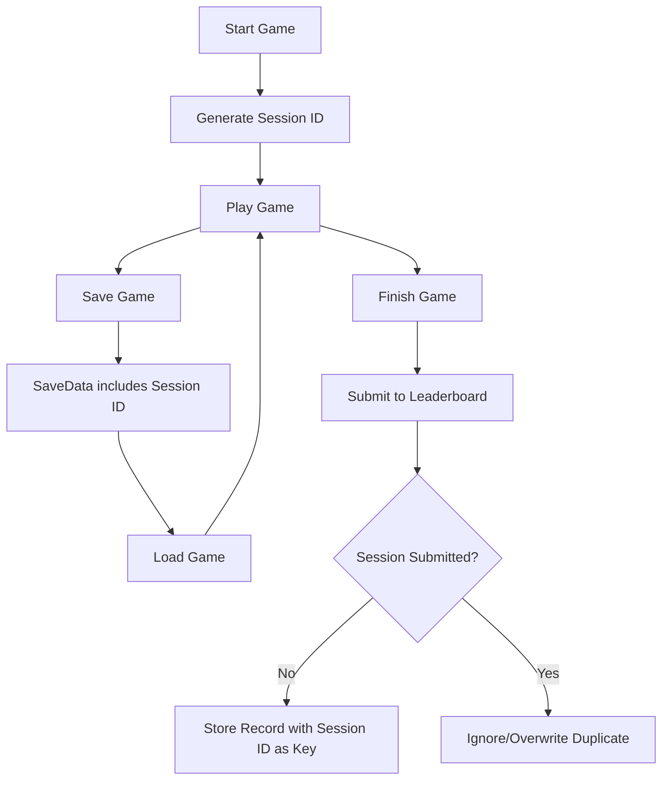

# Requirements

### Overview & Goals
The goal is to prevent users from submitting multiple leaderboard entries for the same game session by abusing the save/load feature. Currently, anonymous users create a new record every time they finish the game, allowing them to reload a save just before completion and finish repeatedly to spam the leaderboard.

### Scope
- **In Scope**:
    - Tracking unique game sessions with a `sessionId`.
    - Persisting `sessionId` in local and cloud saves.
    - Ensuring anonymous leaderboard entries use `sessionId` as a unique key to prevent duplicates.
    - Preventing re-submission of the same session ID.
- **Out of Scope**:
    - Changing the overall leaderboard structure for logged-in users (beyond fixing the abuse).
    - Implementing complex anti-cheat measures (e.g., server-side validation of game moves).

### User Stories
- **As a developer**, I want to ensure the leaderboard is not cluttered with duplicate entries from the same game session.
- **As a fair player**, I want to know that other players cannot easily cheat their way to multiple or "perfected" leaderboard entries by reloading saves.

# Technical Design

### Current Implementation
- `useGameFlow.ts` handles game start/end but doesn't track a unique session.
- `useSavedData.ts` saves/loads the entire game state but doesn't include a session identifier.
- `useFirebase.ts` uses `addDoc` for anonymous leaderboard records, which creates a new entry every time. For logged-in users, it uses `user.uid` as the key, which overwrites the previous record.

### Proposed Changes

#### 1. Unique Session Tracking
We will introduce a `sessionId` that is generated once when a new game starts and stays with that game session even if it's saved and loaded.

- **`src/types.ts`**: Update `GameFlowState` and `SaveData` to include `sessionId: string | null`.
- **`src/stores/useGameFlow.ts`**: 
    - Initialize `sessionId` to `null`.
    - In `startGame()`, generate a new ID: `flowState.sessionId = self.crypto.randomUUID()`.
- **`src/composables/useSavedData.ts`**:
    - `getSavedState()`: Include `flowState.sessionId` in the returned object.
    - `applyState()`: Set `flowState.sessionId` from the loaded data (fallback to a new UUID if missing for backward compatibility).

#### 2. Leaderboard Submission Logic
We will modify `createRecord` in `useFirebase.ts` to use the `sessionId` for identification.

- **For Anonymous Users**: Use `setDoc(doc(db, 'leaderboards', sessionId), payload)` instead of `addDoc`. This ensures that multiple submissions from the same session will overwrite the same document instead of creating new ones.
- **Abuse Prevention**: Before calling `setDoc`, check if a record with the same `sessionId` already exists. If it does, and we want to strictly prevent "reload and finish" abuse, we should ignore the new submission or only allow it if it's not the exact same session being re-submitted.

### Key Decisions
- **Use `sessionId` as document ID for anonymous users**: This is the simplest and most effective way to prevent "a lot of bad records" in Firestore without requiring a complex backend.
- **Persistence in JSON saves**: By including the `sessionId` in the JSON save file, we ensure the protection persists even if the user clears their browser cache or switches devices.

### Risks
- **Backward Compatibility**: Existing save files won't have a `sessionId`. The plan handles this by generating a new one upon loading an old save, which will then be treated as a fresh session for leaderboard purposes.

# Delivery Steps

###   Step 1: Introduce Session ID to track game sessions
Add a `sessionId` field to track unique game sessions and ensure it's persisted in save files.
- Update `GameFlowState` and `SaveData` types in `src/types.ts`.
- Update `useGameFlow` store to generate a new `sessionId` on game start.
- Update `useSavedData` composable to include `sessionId` in `getSavedState` and restore it in `applyState`.

###   Step 2: Implement duplicate prevention in leaderboard submission
Modify the leaderboard submission logic to use the `sessionId` for identifying records and preventing duplicates.
- Update `createRecord` in `useFirebase.ts` to use `sessionId` as the document ID for anonymous users (replacing `addDoc` with `setDoc`).
- Implement a check to prevent re-submitting the same `sessionId` to avoid "reload and finish" abuse.
